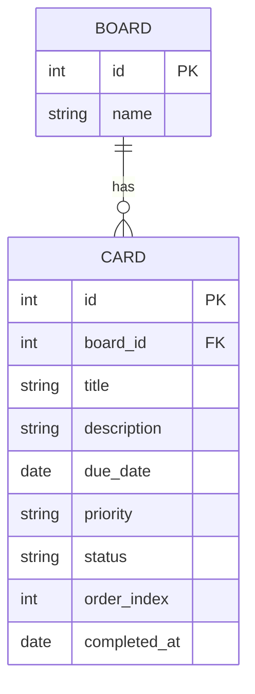

# データベース設計

## ER図

---

## テーブル定義

### boards テーブル

| カラム名 | 型 | 制約 | 説明 |
|----------|----|------|------|
| id | BIGSERIAL | PK | ボードID |
| name | TEXT | NOT NULL | ボード名 |

### cards テーブル

| カラム名 | 型 | 制約 | 説明 |
|----------|----|------|------|
| id | BIGSERIAL | PK | カードID |
| board_id | BIGINT | FK → boards.id, NOT NULL | 所属ボードID |
| title | TEXT | NOT NULL | タスクのタイトル |
| description | TEXT | | 説明文（任意） |
| due_date | DATE | | 期限日（任意） |
| priority | TEXT | | 優先度：高 / 中 / 低（任意） |
| status | TEXT | NOT NULL, CHECK IN ('todo','in_progress','done') | カードの状態 |
| order_index | INTEGER | NOT NULL | 列内での表示順 |
| completed_at | DATE | | ステータスが done になった日付 |

---

## 補足

- データベースエンジンは PostgreSQL 15 を使用する
- マイグレーションは Flyway で管理し、Spring Boot 起動時に自動実行される
  - `V1__create_tables.sql`: boards / cards テーブル作成
  - `V2__insert_initial_data.sql`: board 1件の初期データ投入
  - `V3__insert_test_cards.sql`: 確認用テストカードの投入
  - `V4__add_completed_at_to_cards.sql`: cards テーブルに completed_at カラムを追加
- 列（未着手/進行中/完了）は `cards.status` の値で区別する。`columns` テーブルは存在しない
- インデックス: `idx_cards_board_id`（board_id）、`idx_cards_status`（status）
