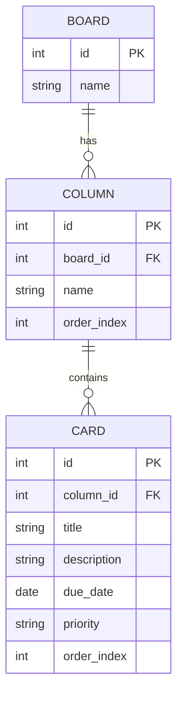

# データベース設計

## ER図

---

## テーブル定義

### boards テーブル

| カラム名 | 型 | 制約 | 説明 |
|----------|----|------|------|
| id | INTEGER | PK, AUTO INCREMENT | ボードID |
| name | TEXT | NOT NULL | ボード名 |

### columns テーブル

| カラム名 | 型 | 制約 | 説明 |
|----------|----|------|------|
| id | INTEGER | PK, AUTO INCREMENT | 列ID |
| board_id | INTEGER | FK → boards.id | 所属ボードID |
| name | TEXT | NOT NULL | 列名（未着手 / 進行中 / 完了） |
| order_index | INTEGER | NOT NULL | 列の表示順 |

### cards テーブル

| カラム名 | 型 | 制約 | 説明 |
|----------|----|------|------|
| id | INTEGER | PK, AUTO INCREMENT | カードID |
| column_id | INTEGER | FK → columns.id | 所属列ID |
| title | TEXT | NOT NULL | タスクのタイトル |
| description | TEXT | | 説明文（任意） |
| due_date | DATE | | 期限日（任意） |
| priority | TEXT | | 優先度：high / medium / low（任意） |
| order_index | INTEGER | NOT NULL | 列内での表示順 |

---

## 補足

- データベースエンジンは SQLite を使用する
- 初回起動時に boards・columns テーブルの初期データ（固定の3列）をシードとして挿入する
- 詳細なインデックス設計は実装フェーズで定義する
