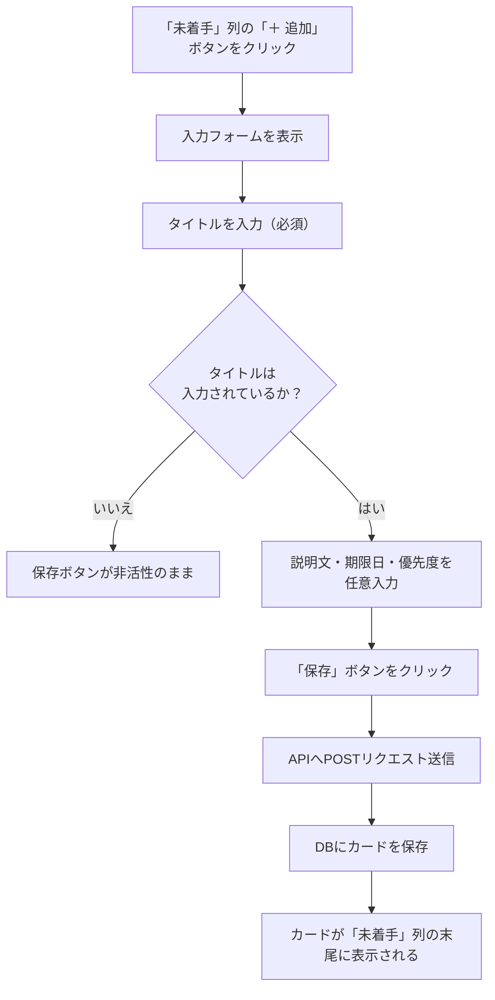
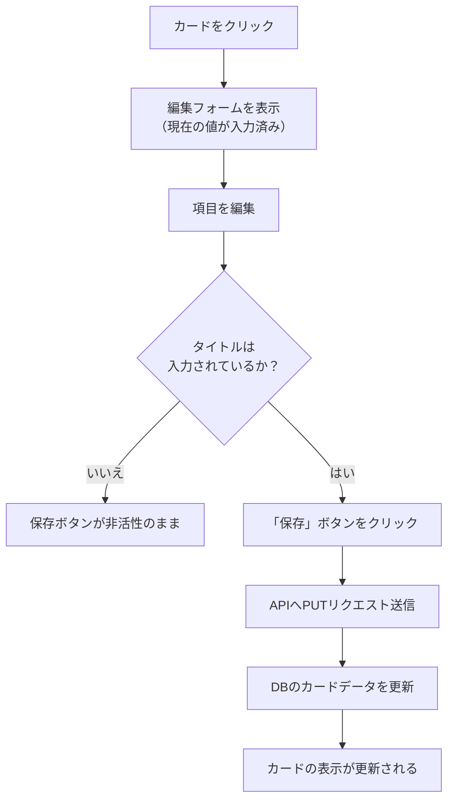
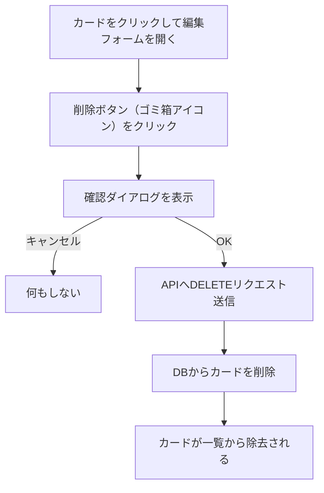
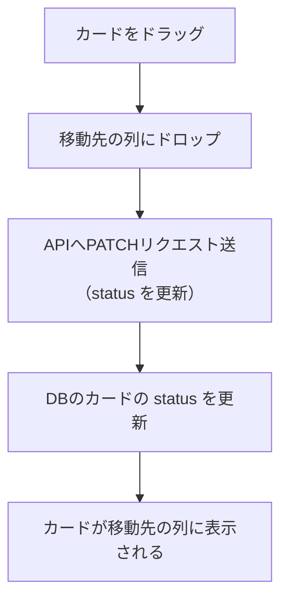
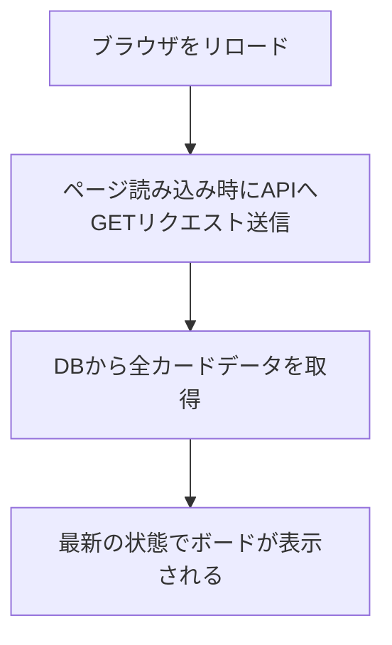
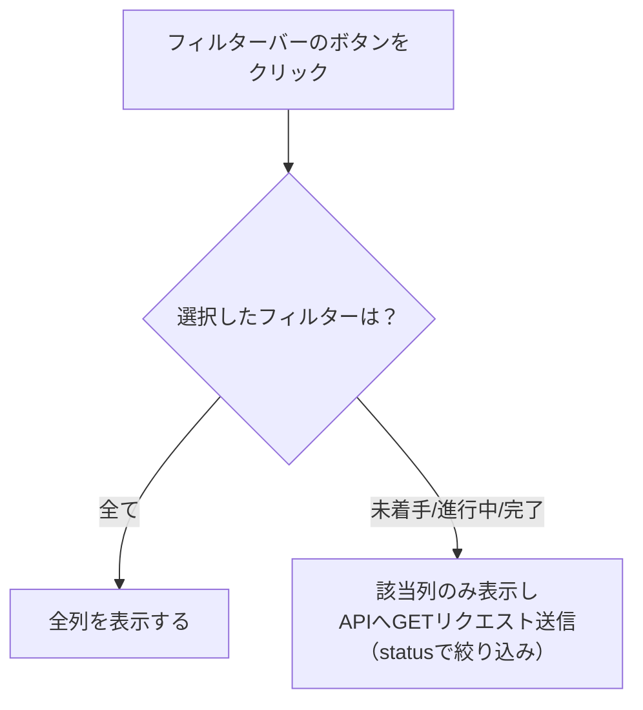

# 機能要件

## 1. ボード（画面全体）

- 画面を開くと、3つの列が横に並んで表示される
- 列の構成は固定（変更・追加・削除はできない）

---

## 2. 列（表示上の区分）

画面上は固定の3列で構成される。列はテーブルとして管理せず、カードの `status` 値によって振り分けて表示する。

| status 値 | 表示名 | 役割 |
|-----------|--------|------|
| `todo` | 未着手 | まだ手をつけていないタスク |
| `in_progress` | 進行中 | 現在取り組んでいるタスク |
| `done` | 完了 | 終わったタスク |

---

## 3. カード（タスク）

カード1枚が1つのタスクを表す。

**カードに含まれる情報**

| 項目 | 必須/任意 | 内容 |
|------|-----------|------|
| タイトル | 必須 | タスクの名前 |
| 説明文 | 任意 | タスクの詳細メモ |
| 期限日 | 任意 | いつまでに終わらせるか |
| 優先度 | 任意 | 高・中・低の3段階 |

**カードに対してできる操作**

| 操作 | 説明 |
|------|------|
| 追加 | 「未着手」列の「＋ 追加」ボタンからカードを新規作成する |
| 編集 | カードをクリックして内容を変更する |
| 削除 | カードをクリックして開く編集フォームの削除ボタンで削除する |
| 列間移動 | ドラッグ&ドロップで別の列に移動する |

---

## 4. フィルターバー

画面上部にフィルターバーを表示する。

| ボタン | 動作 |
|--------|------|
| 全て | 全列を表示する（デフォルト） |
| 未着手 | 未着手列のみ表示する |
| 進行中 | 進行中列のみ表示する |
| 完了 | 完了列のみ表示する |

---

## ユースケース一覧

| UC# | ユースケース名 | 概要 |
|-----|--------------|------|
| UC-01 | カードを追加する | 「未着手」列にタスクカードを新規作成する |
| UC-02 | カードを編集する | 既存カードのタイトル・説明文・期限日・優先度を変更する |
| UC-03 | カードを削除する | 不要になったカードを削除する |
| UC-04 | カードを列間移動する | ドラッグ&ドロップで別の列へカードを移動する |
| UC-05 | データを保持する | ページをリロードしてもDBからデータが復元される |
| UC-06 | カードをフィルターする | フィルターバーで表示する列を絞り込む |

---

## 操作フロー

### UC-01: カードを追加する

### UC-02: カードを編集する

### UC-03: カードを削除する

### UC-04: カードを列間移動する

### UC-05: データを保持する

### UC-06: カードをフィルターする

---

## エラー・例外ケース

| ケース | 発生条件 | システムの振る舞い |
|--------|----------|------------------|
| タイトル未入力で保存 | カード追加・編集時にタイトルが空のまま「保存」を押した場合 | 保存ボタンが非活性のため押せない。APIでも400エラーを返す |
| APIリクエスト失敗 | サーバーが停止しているなどでAPIが応答しない場合 | エラーメッセージを表示し、操作前の表示状態を維持する |
| 初回起動時（データなし） | DBにデータが存在しない状態でページを開いた場合 | 3列が空の状態で正常に表示される |
