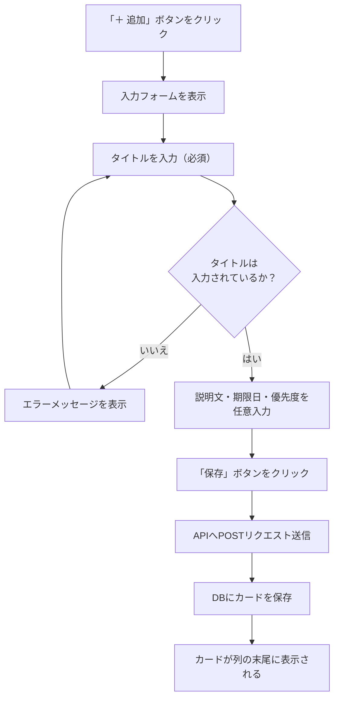
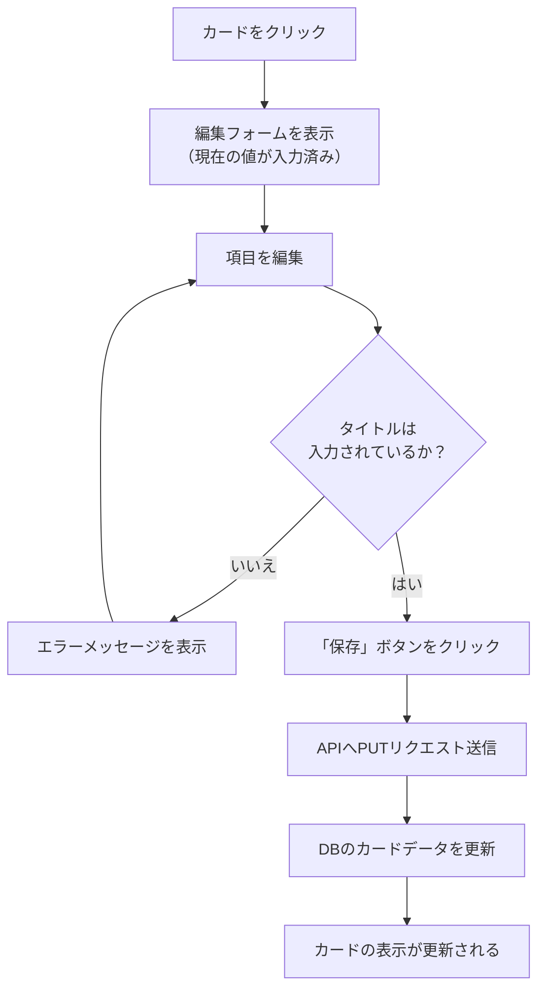
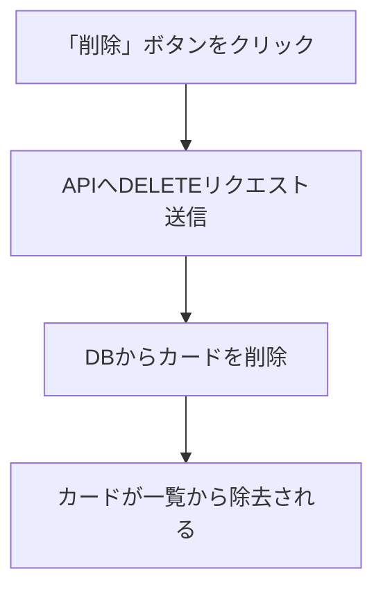
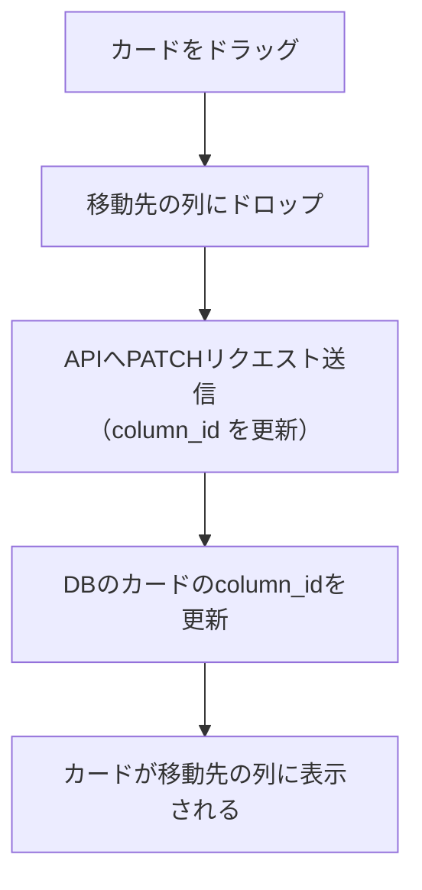
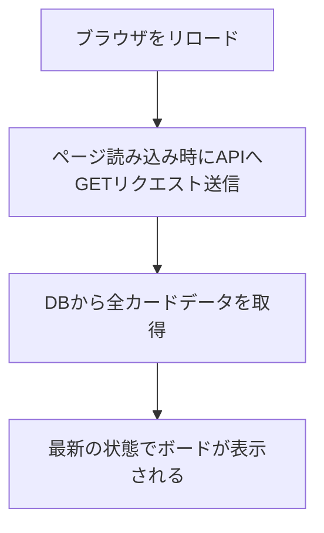

# 機能要件

## 1. ボード（画面全体）

- 画面を開くと、3つの列が横に並んで表示される
- 列の構成は固定（変更・追加・削除はできない）

---

## 2. 列（リスト）

| 列名 | 役割 |
|------|------|
| 未着手 | まだ手をつけていないタスク |
| 進行中 | 現在取り組んでいるタスク |
| 完了 | 終わったタスク |

---

## 3. カード（タスク）

カード1枚が1つのタスクを表す。

**カードに含まれる情報**

| 項目 | 必須/任意 | 内容 |
|------|-----------|------|
| タイトル | 必須 | タスクの名前 |
| 説明文 | 任意 | タスクの詳細メモ |
| 期限日 | 任意 | いつまでに終わらせるか |
| 優先度 | 任意 | 高・中・低の3段階 |

**カードに対してできる操作**

| 操作 | 説明 |
|------|------|
| 追加 | 各列の「＋」ボタンからカードを新規作成する |
| 編集 | カードをクリックして内容を変更する |
| 削除 | カード上の「削除」ボタンで削除する |
| 移動 | ドラッグ&ドロップで別の列に移動する |

---

## ユースケース一覧

| UC# | ユースケース名 | 概要 |
|-----|--------------|------|
| UC-01 | カードを追加する | 任意の列にタスクカードを新規作成する |
| UC-02 | カードを編集する | 既存カードのタイトル・説明文・期限日・優先度を変更する |
| UC-03 | カードを削除する | 不要になったカードを削除する |
| UC-04 | カードを移動する | ドラッグ&ドロップで別の列へカードを移動する |
| UC-05 | データを保持する | ページをリロードしてもDBからデータが復元される |

---

## 操作フロー

### UC-01: カードを追加する

### UC-02: カードを編集する

### UC-03: カードを削除する

### UC-04: カードを移動する

### UC-05: データを保持する

---

## エラー・例外ケース

| ケース | 発生条件 | システムの振る舞い |
|--------|----------|------------------|
| タイトル未入力で保存 | カード追加・編集時にタイトルが空のまま「保存」を押した場合 | エラーメッセージを表示し、保存せずフォームを開いたままにする |
| APIリクエスト失敗 | サーバーが停止しているなどでAPIが応答しない場合 | エラーメッセージを表示し、操作前の表示状態を維持する |
| 初回起動時（データなし） | DBにデータが存在しない状態でページを開いた場合 | 3列が空の状態で正常に表示される |
