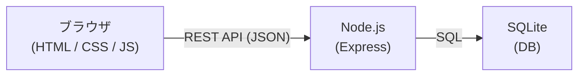

# 技術スタック

## 使用技術

| 役割 | 技術 |
|------|------|
| 画面の構造 | HTML |
| 見た目・デザイン | CSS |
| フロントエンド動作 | JavaScript |
| ドラッグ&ドロップ | HTML5標準のDrag and Drop API |
| バックエンド | Node.js + Express |
| データベース | SQLite |
| API通信 | REST API（JSON） |

---

## システム構成

### 構成の概要

| レイヤー | 技術 | 役割 |
|----------|------|------|
| フロントエンド | HTML / CSS / JavaScript | UIの描画・ユーザー操作の受け付け・APIとの通信 |
| バックエンド | Node.js + Express | RESTful APIの提供・リクエストのルーティング |
| データベース | SQLite | タスクデータの永続化 |
