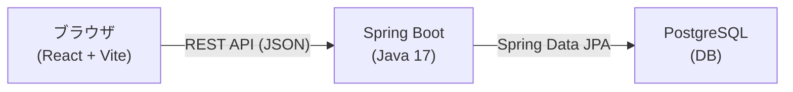

# 技術スタック

## 1. フロントエンド

| 役割 | 技術 | 選定理由 |
|------|------|----------|
| UIフレームワーク | React 18 | スクール指定（Next.js除く） |
| ビルドツール | Vite | CRAより高速・モダン、設定シンプル |
| ドラッグ&ドロップ | @dnd-kit/core + @dnd-kit/sortable | React向けモダンライブラリ、アクセシブル |
| HTTPクライアント | Axios | シンプルなAPI、エラーハンドリングしやすい |
| スタイリング | plain CSS（CSS Modules） | 依存最小、スクール課題に適切 |

---

## 2. バックエンド

| 役割 | 技術 | 選定理由 |
|------|------|----------|
| 言語 | Java 17 | スクール指定 |
| フレームワーク | Spring Boot 3.x | スクール指定 |
| REST API | Spring Web | Spring Boot標準、JSONレスポンス |
| ORM | Spring Data JPA + Hibernate | Spring Boot標準、PostgreSQLとの相性○ |
| バリデーション | Spring Validation | 入力チェックを宣言的に記述 |
| 定型コード削減 | Lombok | getter/setter等の自動生成 |
| CORS設定 | Spring Web CorsFilter | フロント（localhost:5173）からのリクエストを許可 |

---

## 3. データベース

| 役割 | 技術 | 選定理由 |
|------|------|----------|
| データベースエンジン | PostgreSQL 15 | スクール指定 |
| マイグレーション | Flyway | Spring Boot起動時に自動実行、初期データ投入も可能 |
| JDBCドライバ | postgresql（公式ドライバ） | PostgreSQL接続に必須 |

---

## 4. 開発ツール

| 役割 | 技術 | 選定理由 |
|------|------|----------|
| Javaビルドツール | Gradle（Groovy DSL） | スクール指定 |
| API通信形式 | REST API（JSON） | フロント・バック間の標準的な通信方式 |

---

## システム構成

### 構成の概要

| レイヤー | 技術 | 役割 |
|----------|------|------|
| フロントエンド | React 18 + Vite | UIの描画・ユーザー操作の受け付け・APIとの通信 |
| バックエンド | Java Spring Boot 3.x | RESTful APIの提供・ビジネスロジック |
| ORM | Spring Data JPA + Hibernate | Javaオブジェクト↔DBテーブルのマッピング |
| DBマイグレーション | Flyway | テーブル作成・初期データ投入の自動管理 |
| データベース | PostgreSQL 15 | タスクデータの永続化 |
